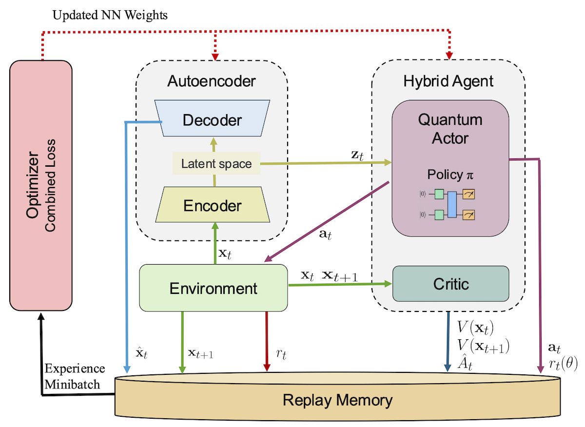

<h1 align='center'>Hybrid Quantum-Classical Reinforcement Learning in Latent Observation Spaces</h1>
<br>
<div align='center'>
    <a href='https://arxiv.org/abs/2410.18284'></a>
</div>

## 🔧️ Framework



## ⚙️ Installation
The Docker image with the required dependencies can be built by running the `build-docker-image.sh` script inside the `docker` folder.
The script requires the TensorFlow version as a parameter

Example:
```sh
cd docker
./build-docker-image.sh 2.15.0-gpu
```
After the image has been build, the source code can be mounted like this:
```sh
docker run -it --rm -v $PWD:/host qml/latent-qrl:latest
```

## Project structure
```
...
encoders/
├─ environment_name
    ├─ ae_name
        ├─ run.sh
        ├─ continue.sh
        ├─ config.json
        ├─ checkpoint/
            ├─ best_encoder
            ├─ best_decoder
experiments/
├─ experiment_name/
│   ├─ run.sh
│   ├─ continue.sh
│   ├─ config.json
│   ├─ results/
│   │   ├─ 0/
│   │   │  ├─ progress.csv
│   │   │  ├─ checkpoint/
│   │   ├─ 1/
│   │   │  ├─ progress.csv
│   │   │  ├─ checkpoint/
│   │   ├─ 2/
│   │   │  ├─ progress.csv
│   │   │  ├─ checkpoint/
│   │   ├─ 3/
│   │   │  ├─ progress.csv
│   │   │  ├─ checkpoint/
```
Every numerical experiment is defined in a config json file. This json file contains every hyperparameter and every detail of the given experiment.
A results directory contains numbered subdirectories for each agent. Each of these subdirectories contain a `progress.csv` file in which we track agent rewards and additional info. 
Additionally, these subdirectories contain a checkpoint directory, where we save network parameters during training, so we can continue the process, or load a pre-trained agent for inference. 

## AE Pre Training
There are two training scripts for pre-training autoencoders.
- `train-ae.py` script uses eager execution
- `train-ae-tf-function.py` uses Autograph.

Their JSON configuration files have different structures, but their command-line arguments are identical.

Example:
```sh
python train-ae.py --dataset-path=<path-to-dataset> --save-path=<folder-to-save-results> --config-path=<path-to-config.json> --no-pdf
```

## Agent Trainng
As with autoencoder pre-training, there are two options for agent training
- `train_ppo_agent.py` uses eager execution.
- `train_ppo_agent_tf_function.py` uses Autograph.

Additionally, the `train_ppo_multiprocess.py` script can be used to train multiple agents simultaneously.

Example:
```sh
python ../../train_ppo_multiprocess.py --save-path=<folder-to-save-results> --config-file=<path-to-config.json> --n-agents=<number-of-agents> --script-path=./train_ppo_agent_tf_function
```
For mulit-GPU system the `train_ppo_multiprocess_gpu.py` script can be used to assign the agents to different GPU devices.

## 📝 Citation

If you find our work useful for your research, please consider citing the paper:

```
@misc{dnagyHybrid2024,
	title={Hybrid Quantum-Classical Reinforcement Learning in Latent Observation Spaces},
	author={Dániel T. R. Nagy and Csaba Czabán and Bence Bakó and Péter Hága and Zsófia Kallus and Zoltán Zimborás},
    year={2024},
    eprint={2410.18284},
    archivePrefix={arXiv},
    primaryClass={quant-ph},
    url={https://arxiv.org/abs/2410.18284}, 
}
```
